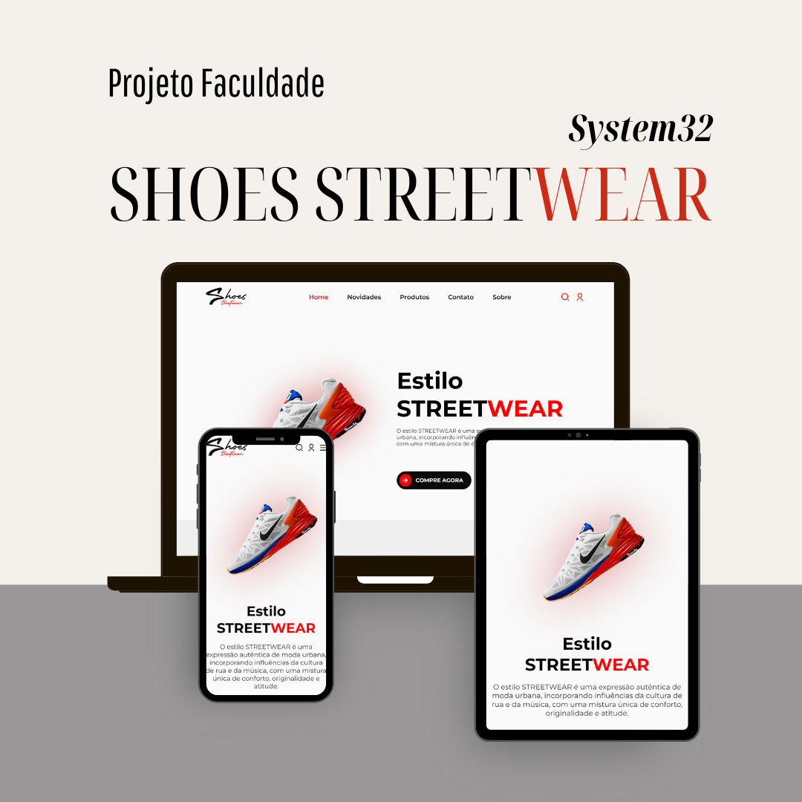

# STREETWEAR: Projeto eCommerce para Faculdade

[STREETWEAR](https://vitorkeller1604.github.io/Projeto-Faculdade/) Este projeto tem como objetivo desenvolver uma plataforma de eCommerce que facilite a compra de produtos online. O sistema foi projetado para atender os consumidores, oferecendo uma experiência intuitiva e segura.

<h4 align="center"><a href="https://vitorkeller1604.github.io/Projeto-Faculdade/">Clique para visitar o projeto</a></h4>

## Técnologias Utilizadas ##

* HTML
* CSS
* Javascript
